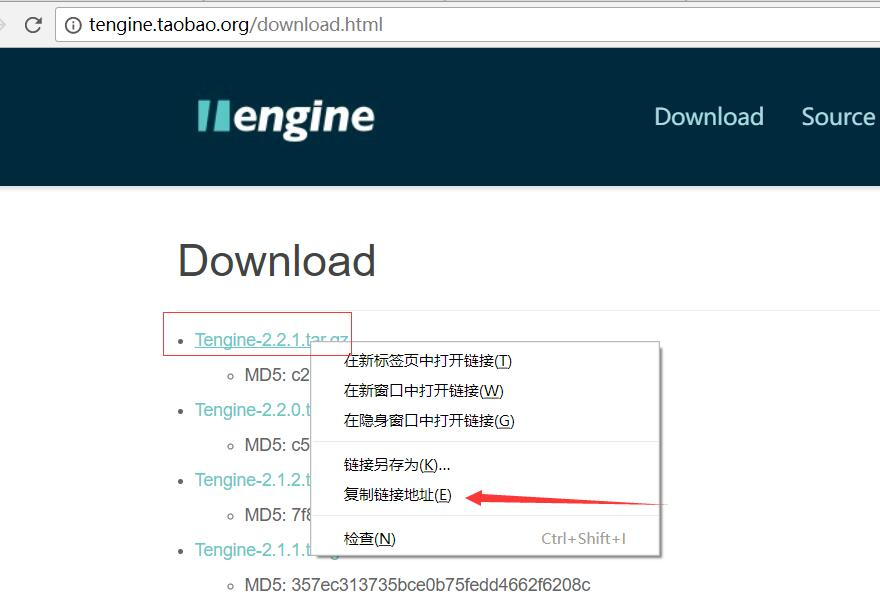
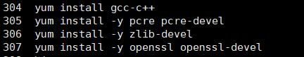

###### Centos 安装 Tengine
Tengine是Nginx的超集，阿里开源项目，阿里云负载均衡就是基于Tengine

1. 官网下载

2. 安装依赖
    
    
3. 编译安装Tengine  
  ./configure --prefix=/etc/tengine   
  make    
  make install  
  
4. 环境变量   
  ln -s /etc/tengine/sbin/nginx     /usr/local/bin/nginx
  